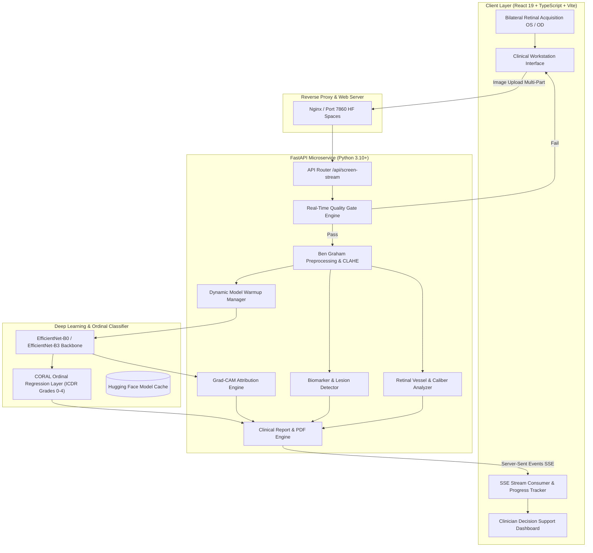

<div align="center">

# 👁️ INFINITE LOOPS — SIH26038
### Explainable AI for Diabetic Retinopathy Screening in Rural India
**Clinical Decision Support System (CDSS) for Tele-Ophthalmology & Primary Health Centres**

[](https://www.sih.gov.in/)
[](https://react.dev/)
[](https://www.typescriptlang.org/)
[](https://fastapi.tiangolo.com/)
[](https://keras.io/)
[](https://www.docker.com/)
[](LICENSE)

</div>

---

## 📋 Table of Contents
- [Clinical Safety Notice](#-clinical-safety-notice)
- [Problem Context & Healthcare Impact](#-problem-context--healthcare-impact)
- [System Architecture](#-system-architecture)
- [Key Features & Capabilities](#-key-features--capabilities)
- [End-to-End Clinical Screening Workflow](#-end-to-end-clinical-screening-workflow)
- [Explainable AI & Biomarker Detection](#-explainable-ai--biomarker-detection)
- [Tele-Ophthalmology & Simulink Simulation](#-tele-ophthalmology--simulink-simulation)
- [Technology Stack](#-technology-stack)
- [Repository Structure](#-repository-structure)
- [Quick Start Guide](#-quick-start-guide)
  - [Prerequisites](#prerequisites)
  - [Option 1: Docker (Recommended)](#option-1-docker-recommended)
  - [Option 2: Local Development Setup](#option-2-local-development-setup)
- [API Reference & Streaming Protocol](#-api-reference--streaming-protocol)
- [Dataset Preparation & Model Training](#-dataset-preparation--model-training)
- [Testing & Quality Assurance](#-testing--quality-assurance)
- [Regulatory & SaMD Compliance](#-regulatory--samd-compliance)
- [Team INFINITE LOOPS](#-team-infinite-loops)

---

## ⚕️ Clinical Safety Notice

> [!IMPORTANT]
> **INVESTIGATIONAL USE / CLINICAL DECISION SUPPORT NOTICE**  
> This software is an **AI-assisted screening triage prototype** designed to assist healthcare workers and optometrists in identifying referable cases. **It does not provide a definitive medical diagnosis.** All automated assessments, severity classifications, and Grad-CAM heatmaps must be reviewed and confirmed by a certified ophthalmologist or qualified medical professional before clinical decisions, interventions, or surgical escalations are made.

---

## 🌍 Problem Context & Healthcare Impact

India is colloquially known as the **"Diabetes Capital of the World"**, with over **101 million diagnosed individuals** and an additional **136 million pre-diabetic individuals**. Up to **20%–30%** of diabetic patients will develop **Diabetic Retinopathy (DR)** — the primary cause of preventable blindness among working-age adults.

### The Rural Healthcare Disparity
| Challenge | Real-World Context in Rural India | System Intervention |
|:---|:---|:---|
| **Specialist Shortage** | 70% of the Indian population resides in rural areas, yet **>85% of ophthalmologists practice in urban tier-1/tier-2 centers**. | Enables ASHA workers and PHC staff to screen patients with automated AI triage. |
| **Image Quality Degradation** | Low-cost hand-held fundus cameras in dusty/humid field conditions frequently yield blurry, off-center, or under-exposed scans. | **Automated Multi-Metric Quality Gate** rejects ungradable images in real-time before patient departure. |
| **Black-Box AI Skepticism** | Clinicians hesitate to trust standard neural networks without anatomical evidence. | **Explainable AI (Grad-CAM + Lesion Localization)** provides visual verification for every prediction. |
| **Bandwidth & Latency Constraints** | Rural PHCs frequently suffer from intermittent or high-latency 2G/3G connections. | **Edge-ready inference** with local SSE streaming, offline simulation mode, and lightweight payload architecture. |

---

## 🏛️ System Architecture



---

## ✨ Key Features & Capabilities

- **Bilateral Retinal Screening:** Simultaneous evaluation of Right Eye (OD - *Oculus Dexter*) and Left Eye (OS - *Oculus Sinister*) with anatomical side-by-side comparison.
- **Real-Time Automated Quality Gate:** Pre-inference quality verification assessing:
  - **Focus & Sharpness:** Variance of the Laplacian and edge frequency response.
  - **Illumination & Exposure:** Luminance histogram entropy and over/under-exposure clipping.
  - **Field of View (FOV):** Retinal boundary circularity and valid sensor coverage percentage.
  - **Anatomical Validity:** Green-channel vessel contrast validation to detect non-retinal uploads.
- **Guided Recapture Recovery Loop:** Dynamic clinical instructions for field operators (e.g., *"Adjust illumination — scan is underexposed"*, *"Reposition patient chin rest — scan off-center"*).
- **International Clinical Diabetic Retinopathy (ICDR) Grading:**
  - **Grade 0:** No Apparent Retinopathy
  - **Grade 1:** Mild Non-Proliferative DR (NPDR) — Microaneurysms only
  - **Grade 2:** Moderate NPDR — More than microaneurysms, but less than severe
  - **Grade 3:** Severe NPDR — 4-2-1 rule (intraretinal hemorrhages, venous beading, IRMA)
  - **Grade 4:** Proliferative Diabetic Retinopathy (PDR) — Neovascularization, vitreous hemorrhage
- **Referable DR (RDR) Triage Alert:** Immediate high-priority flag when severity grade $\ge 2$ or clinically significant macular edema is indicated.
- **Deep Explainable AI (XAI):**
  - High-resolution **Grad-CAM heatmaps** overlaid directly on fundus scans.
  - Identification and count of cardinal biomarkers: **Microaneurysms, Hemorrhages, Hard Exudates, Cotton Wool Spots (Soft Exudates), and Neovascularization**.
  - **Retinal Vessel Analysis:** Vascular segmentation, caliber ratio (arteriolar-to-venular), and vessel tortuosity index.
- **Clinician Review Workspace:** Human-in-the-loop confirmation, manual grade adjustments with clinical justification logging, longitudinal exam comparison, and automated PDF export.
- **Simulation Modeling:** MATLAB / Simulink discrete-event models evaluating rural tele-screening queue lengths, network delays, and doctor review throughput.

---

## 🔄 End-to-End Clinical Screening Workflow

```
[ 1. Session Init ] ➔ [ 2. Bilateral Acq ] ➔ [ 3. Quality Gate ] ➔ [ 4. Preprocessing ]
                                                      │ (Quality Fail)
                                                      ▼
                                              [ Recapture Loop ]
                                                      │
[ 8. PDF Export ] ⬅ [ 7. Clinician Review ] ⬅ [ 6. XAI & Lesions ] ⬅ [ 5. Deep AI Inference ]
```

1. **Session Initialization:** Register patient demographic info, diabetes duration, HbA1c history, and optical symptoms.
2. **Bilateral Image Acquisition:** Ingest fundus captures from supported digital ophthalmoscopes.
3. **Automated Quality Gate:** Images must pass sharpness, exposure, and coverage thresholds ($\ge 0.50$).
4. **Retinal Preprocessing:** 
   - Circular mask extraction (removing camera aperture border).
   - Ben Graham color normalization (subtracting local Gaussian blur to equalize illumination variations).
   - Contrast Limited Adaptive Histogram Equalization (CLAHE) on the green channel.
5. **Deep AI Inference:** Feature extraction via EfficientNet and ordinal classification via CORAL to preserve rank consistency across disease progression.
6. **Explainability & Lesion Segmentation:** Grad-CAM generation and morphological detection of hemorrhagic and exudative lesions.
7. **Clinician Confirmation Workspace:** Tele-ophthalmologist inspects scans, heatmaps, and lesion counts; can confirm or override AI decision.
8. **Clinical Report & Export:** One-click generation of patient consultation summaries in PDF and CSV format.

---

## 🔬 Explainable AI & Biomarker Detection

Standard deep learning classification models often suffer from "shortcut learning" (e.g., associating dust specks on lens with pathology). Our architecture implements multi-tier verification:

### 1. Grad-CAM (Gradient-Weighted Class Activation Mapping)
Computes gradients of the target DR severity score with respect to the final convolutional feature maps in the EfficientNet backbone, visualizing the exact anatomical regions driving the network's classification.

### 2. Biomarker Extraction Engine
| Biomarker | Pathological Significance | Detection Method |
|:---|:---|:---|
| **Microaneurysms (MAs)** | Earliest clinically detectable sign; localized outpouchings of capillary walls. | Morphological top-hat transform + green-channel local minima filtering. |
| **Hemorrhages (HEMs)** | Ruptured capillaries indicating advancing vascular compromise (Dot/Blot or Flame). | Adaptive thresholding + area/circularity filtering. |
| **Hard Exudates (EXs)** | Lipid and lipoprotein leakage from incompetent capillaries. | High-luminance segmentation on green/blue channels + edge gradient verification. |
| **Cotton Wool Spots** | Micro-infarctions of retinal nerve fiber layers (Soft Exudates). | Low-contrast boundary detection + regional texture variance. |
| **Neovascularization** | Hall-mark of proliferative DR (PDR); abnormal fragile new vessels. | Vessel tree density analysis and peripheral capillary branching estimation. |

---

## 📡 Tele-Ophthalmology & Simulink Simulation

Under `simulink/` and `matlab/`, we provide complete mathematical models simulating rural deployment scenarios:

- **System Model:** Fundus Camera $\rightarrow$ Quality Gate $\rightarrow$ Edge AI Preprocessing $\rightarrow$ Network Transmission $\rightarrow$ Specialist Review Queue.
- **Simulated Variables:**
  - Patient arrival rate: $10 - 50\text{ scans/hr}$
  - Bandwidth constraint: $1 - 10\text{ Mbps}$ (Rural cellular latency)
  - Edge AI Processing Latency: $2 - 10\text{ seconds}$
  - Specialist Review Capacity: $5 - 20\text{ cases/hr}$
- **Run Simulation:**
  ```matlab
  open('simulink/models/screening_workflow.slx');
  run('matlab/inference.m');
  ```

---

## 🛠️ Technology Stack

### Frontend Application
- **Core:** [React 19](https://react.dev/), [TypeScript 5.7](https://www.typescriptlang.org/)
- **Bundler & Tooling:** [Vite 6](https://vitejs.dev/)
- **Styling:** Custom Clinical Glassmorphism Design System (Pure Vanilla CSS)
- **Icons:** [Lucide React](https://lucide.dev/)

### Backend & Machine Learning
- **API Framework:** [FastAPI](https://fastapi.tiangolo.com/) with asynchronous event loops
- **ASGI Server:** [Uvicorn](https://www.uvicorn.org/) with Server-Sent Events (SSE) streaming
- **Deep Learning Backbones:** [PyTorch](https://pytorch.org/), [Keras 3](https://keras.io/), [JAX](https://jax.readthedocs.io/)
- **Computer Vision:** [OpenCV (opencv-python)](https://opencv.org/), [Pillow](https://python-pillow.org/)
- **Model Hub:** [Hugging Face Hub](https://huggingface.co/Aldahmashi/DR-EfficientNetB0)
- **Data Science:** [NumPy](https://numpy.org/), [Pandas](https://pandas.pydata.org/), [Scikit-Learn](https://scikit-learn.org/), [SciPy](https://scipy.org/)

### DevOps & Packaging
- **Containerization:** Multi-stage `Dockerfile` (Node 22 build $\rightarrow$ Nginx Alpine runtime)
- **Orchestration:** `docker-compose.yml`
- **Cloud Spaces:** Hugging Face Spaces Docker compatibility (Port 7860)

---

## 📂 Repository Structure

```
SIH26038/
├── .gitignore               # Comprehensive Git ignore rules (Node, Python, ML, OS)
├── Dockerfile               # Multi-stage Docker build for web app and Nginx
├── docker-compose.yml       # Container orchestration configuration
├── nginx.conf               # Production Nginx reverse proxy configuration
├── package.json             # Frontend dependencies and build scripts
├── requirements.txt         # Python backend and machine learning dependencies
├── tsconfig.json            # TypeScript configuration
├── vite.config.ts           # Vite build and proxy settings
│
├── backend/                 # FastAPI service
│   ├── app.py               # REST API, SSE streaming endpoints, static mounts
│   └── schemas.py           # Pydantic request and response data models
│
├── configs/                 # System parameters
│   ├── config.yaml          # Model training, resolution, and threshold configs
│   └── dataset_config.yaml  # Dataset paths, splits, and augmentation params
│
├── data/                    # Dataset metadata and license guidelines
│   └── idrid/               # Indian Diabetic Retinopathy Image Dataset licenses
│
├── explainability/          # Model interpretability algorithms
│   ├── confidence.py        # Softmax entropy and uncertainty estimation
│   ├── gradcam.py           # Layer-wise Grad-CAM heatmap generation
│   └── lesion_evidence.py   # Heuristic lesion attribution masks
│
├── inference/               # Production screening pipeline
│   ├── classifier.py        # EfficientNet model loader and inference wrapper
│   ├── quality_gate.py      # Laplacian sharpness, FOV, and illumination checks
│   ├── lesion_analyzer.py   # Lesion classification and scoring
│   ├── lesion_detectors.py  # Computer vision lesion segmentation algorithms
│   ├── vessel_analyzer.py   # Retinal vessel density and caliber calculation
│   ├── report_generator.py  # Structured clinical diagnostic summaries
│   └── pipeline.py          # End-to-end orchestration pipeline
│
├── matlab/                  # MATLAB verification scripts
│   ├── import_models.m      # ONNX and deep learning model import utilities
│   ├── inference.m          # MATLAB retinal inference validation
│   ├── preprocessing.m      # CLAHE and green-channel filtering
│   └── visualization.m      # Heatmap overlays and fundus visualization
│
├── preprocessing/           # Retinal image conditioning
│   ├── clahe.py             # Contrast Limited Adaptive Histogram Equalization
│   ├── illumination.py      # Background normalization and shadow reduction
│   ├── image_quality.py     # Multi-metric image validation engine
│   ├── retinal_crop.py      # Circular fundus aperture cropping
│   └── transforms.py        # Tensor transforms and resolution resizing
│
├── public/                  # Static assets & test fundus imagery
│   ├── assets/              # Reference fundus test images (OD / OS)
│   └── favicon.svg          # Application icon
│
├── scripts/                 # Utility scripts
│   ├── download_datasets.py # Automated Kaggle downloader (APTOS, IDRiD, DRIVE)
│   ├── run_training.py      # Training execution script
│   └── test_screen_api.py   # Test client for FastAPI screening endpoint
│
├── simulink/                # Workflow simulation
│   ├── README.md            # Simulation documentation
│   └── models/              # Screening throughput and latency models (.slx)
│
├── src/                     # React 19 Frontend source code
│   ├── App.tsx              # Root application component
│   ├── main.tsx             # DOM entry point
│   ├── index.css            # Clinical Glassmorphism Design System
│   ├── components/          # Modular UI components
│   │   ├── acquisition/     # Bilateral image capture & camera feeds
│   │   ├── analysis/        # Real-time inference progress monitor
│   │   ├── layout/          # AppShell, Sidebar, Header, WorkflowTracker
│   │   ├── quality/         # Quality Gate assessment & recapture UI
│   │   ├── results/         # Clinician review dashboard, Grad-CAM viewer
│   │   └── session/         # Patient registration and session start
│   ├── context/             # Screening state management (React Context)
│   ├── services/            # API clients and clinical default mocks
│   └── types/               # TypeScript clinical data definitions
│
├── tests/                   # Python automated unit and regression tests
│   ├── test_classifier.py   # DR classifier tests
│   ├── test_pipeline.py     # End-to-end pipeline tests
│   ├── test_preprocessing.py# Preprocessing transform validation
│   └── test_quality.py      # Quality gate metric tests
│
└── training/                # Deep learning training pipelines
    ├── aptos_dataset.py     # APTOS 2019 dataset loader with oversampling
    ├── calibration.py       # Temperature scaling and probability calibration
    ├── coral.py             # Consistent Rank Logits (CORAL) ordinal layer
    ├── cross_dataset_validation.py # Generalization test across IDRiD & Messidor
    ├── train_aptos_coral.py # EfficientNet + CORAL training pipeline
    └── train_drive_vessels.py # Retinal vessel segmentation training
```

---

## 🚀 Quick Start Guide

### Prerequisites
- **Node.js**: v20.x or higher
- **npm**: v10.x or higher
- **Python**: v3.10, v3.11, or v3.12
- **Docker & Docker Compose** (Optional, for containerized run)

---

### Option 1: Docker (Recommended)

Run the full production-ready workstation inside a containerized environment:

```bash
# Clone the repository
git clone https://github.com/simbisaichinhema/AI-for-Diabetic-Retinopathy-Screening-in-Rural-India.git
cd AI-for-Diabetic-Retinopathy-Screening-in-Rural-India

# Build and start the container
docker-compose up --build
```

The application will be accessible at:
- **Workstation Web UI:** `http://localhost:8000` (or `http://localhost:7860`)
- **API Health Check:** `http://localhost:8000/api/health`

---

### Option 2: Local Development Setup

#### Step 1: Backend Setup (FastAPI)
```bash
# 1. Create and activate a Python virtual environment
python -m venv venv

# On Windows:
.\venv\Scripts\activate
# On Linux / macOS:
source venv/bin/activate

# 2. Install backend dependencies
pip install -r requirements.txt

# 3. Launch the FastAPI server
uvicorn backend.app:app --host 0.0.0.0 --port 8000 --reload
```

#### Step 2: Frontend Setup (React 19 + Vite)
Open a new terminal:
```bash
# 1. Navigate to the project root
cd SIH26038

# 2. Install Node dependencies
npm install

# 3. Create a local environment file (optional, defaults to port 8000)
echo VITE_API_BASE_URL=http://localhost:8000 > .env.local

# 4. Start Vite development server
npm run dev
```

Open **`http://localhost:5173`** in your browser.

> [!TIP]
> If the backend is not running or model weights are downloading, the frontend will automatically enter **Demo Mode**, enabling full UI inspection with synthetic clinical cases and sample fundus photographs.

---

## 📡 API Reference & Streaming Protocol

### 1. Stage-by-Stage Streaming: `POST /api/screen-stream`
Accepts a multipart fundus image file and returns a **Server-Sent Events (SSE)** stream providing live progress for each processing stage:

```bash
curl -X POST "http://localhost:8000/api/screen-stream" \
  -H "accept: text/event-stream" \
  -F "file=@public/assets/head_exact_right.jpg"
```

**Sample Stream Events:**
```json
data: {"type": "stage", "name": "quality_check", "message": "Evaluating sharpness and illumination..."}
data: {"type": "quality", "data": {"focus": 0.88, "illumination": 0.74, "field_of_view": 0.95, "usable": true}}
data: {"type": "stage", "name": "inference", "message": "Running EfficientNetB0 classification..."}
data: {"type": "stage", "name": "gradcam", "message": "Generating Grad-CAM attribution heatmaps..."}
data: {"type": "stage", "name": "lesion_detection", "message": "Segmenting microaneurysms and exudates..."}
data: {"type": "result", "data": { ... }}
```

### 2. Standard Non-Streaming: `POST /api/screen`
```bash
curl -X POST "http://localhost:8000/api/screen" \
  -F "file=@public/assets/head_reference_right.jpg"
```

### 3. Health & System Status: `GET /api/health`
```json
{
  "status": "healthy",
  "version": "2.0.0",
  "timestamp": "2026-09-10T01:30:00.000000"
}
```

### 4. Model Status: `GET /api/models/status`
```json
{
  "warming": false,
  "fallback": false,
  "error": "",
  "models": {
    "classifier": true
  }
}
```

---

## 📊 Dataset Preparation & Model Training

The pipeline is benchmarked across primary public diabetic retinopathy databases:
- **APTOS 2019 Blindness Detection** (3,662 labeled images)
- **IDRiD (Indian Diabetic Retinopathy Image Dataset)** (516 images with pixel-level lesion ground truth)
- **Messidor-2** (1,748 images)
- **DRIVE** (40 images with manual vessel segmentations)

### Download Datasets (via Kaggle API)
Ensure you have your `~/.kaggle/kaggle.json` configured:
```bash
python scripts/download_datasets.py --dataset aptos
```

### Run CORAL Ordinal Regression Training
```bash
python training/train_aptos_coral.py
```

---

## 🧪 Testing & Quality Assurance

Run the automated Python test suite covering quality verification, preprocessing logic, classifier loading, and end-to-end screening:

```bash
# Run backend test suite
pytest tests/ -v

# Run frontend production build validation
npm run build
```

---

## ⚖️ Regulatory & SaMD Compliance

The architecture has been designed around standards outlined in **FDA Software as a Medical Device (SaMD)** and **CDSCO (Central Drugs Standard Control Organisation, India)** specifications:
1. **Traceability:** Every automated prediction logs the exact pipeline version, quality metrics, and probability distribution.
2. **Audit Trail:** Clinician agreement, override status, and comments are stored alongside examination IDs (`case_id`).
3. **Fail-Safe Operation:** In the event of ungradable fundus scans or low model confidence, the system defaults to a mandatory manual referral.

---

## 👥 Team INFINITE LOOPS

- **Smart India Hackathon (SIH 2026)**
- **Problem Statement Code:** SIH26038
- **Project Domain:** Healthcare & Biomedical AI / Tele-Medicine
- **Team Name:** INFINITE LOOPS

---

<div align="center">
  <sub>Developed for Smart India Hackathon 2026. Built with focus on accessibility, clinical safety, and healthcare equity.</sub>
</div>
